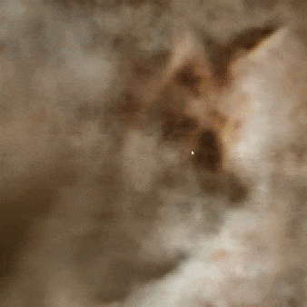

# Fast 3D Style Transfer using Neural Radiance Fields
Applying Artistic Style Transfer to Neural Radiance Field (NeRF), a neural network for
rendering 3D scenes.

This code is based on torch-ngp




# Install

### Install with pip
```bash
pip install -r requirements.txt

# (optional) install the tcnn backbone
pip install git+https://github.com/NVlabs/tiny-cuda-nn/#subdirectory=bindings/torch
```

### Install with conda
```bash
conda env create -f environment.yml
conda activate torch-ngp
```

### Build extension (optional)
By default, we use [`load`](https://pytorch.org/docs/stable/cpp_extension.html#torch.utils.cpp_extension.load) to build the extension at runtime.
However, this may be inconvenient sometimes.
Therefore, we also provide the `setup.py` to build each extension:
```bash
# install all extension modules
bash scripts/install_ext.sh

# if you want to install manually, here is an example:
cd raymarching
python setup.py build_ext --inplace # build ext only, do not install (only can be used in the parent directory)
pip install . # install to python path (you still need the raymarching/ folder, since this only install the built extension.)
```

### Tested environments
* Ubuntu 20 with torch 1.10 & CUDA 11.3 on a TITAN RTX.
* Ubuntu 16 with torch 1.8 & CUDA 10.1 on a V100.
* Windows 10 with torch 1.11 & CUDA 11.3 on a RTX 3070.

Currently, `--ff` only supports GPUs with CUDA architecture `>= 70`.
For GPUs with lower architecture, `--tcnn` can still be used, but the speed will be slower compared to more recent GPUs.


# Usage

The same data format as instant-ngp is used e.g., [fox](https://github.com/NVlabs/instant-ngp/tree/master/data/nerf/fox). 
We already provided some datasets under `./data`.


First time running will take some time to compile the CUDA extensions.

For training the first stage:
```bash
python main_nerf.py data/fox --workspace trial_nerf -O --stage=first
```

For training the second stage:
```bash
python main_nerf.py data/fox -O --workspace trial_nerf --stage=second --style_img_path=./style_img/0.jpg --patch_size=128 --num_rays=16384 --gui --learn_layer color encoder sigma --style_loss=gram --subsampling=downsample --content_weight=3e-5
```

For generating images (images are generated in trial_nerf/results):
```bash
python main_nerf.py data/fox --workspace trial_nerf -O --ckpt="<MODEL_PATH>" --test
```

# Acknowledgement
torch-ngp
```
@misc{torch-ngp,
    Author = {Jiaxiang Tang},
    Year = {2022},
    Note = {https://github.com/ashawkey/torch-ngp},
    Title = {Torch-ngp: a PyTorch implementation of instant-ngp}
}

@article{tang2022compressible,
    title = {Compressible-composable NeRF via Rank-residual Decomposition},
    author = {Tang, Jiaxiang and Chen, Xiaokang and Wang, Jingbo and Zeng, Gang},
    journal = {arXiv preprint arXiv:2205.14870},
    year = {2022}
}
```
<p><a href="https://github.com/zausin33/StyleNeRF/blob/main/assets/poster.pdf">Poster</a></p>
<p><a href="https://github.com/zausin33/StyleNeRF/blob/main/assets/paper.pdf">Report</a></p>
